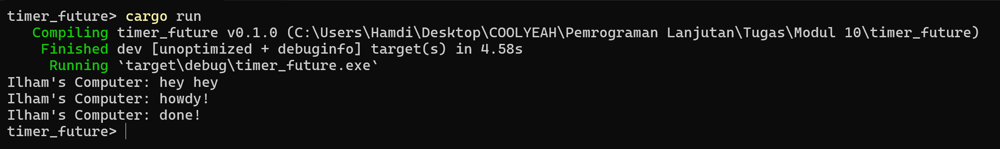
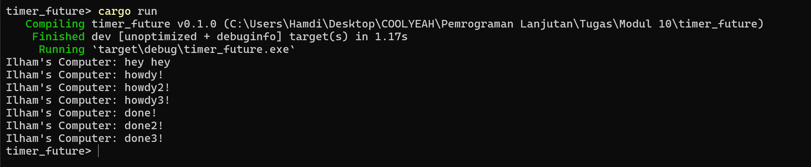
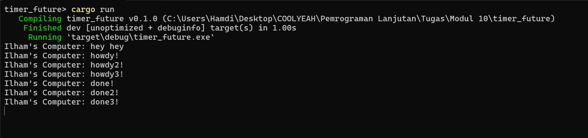
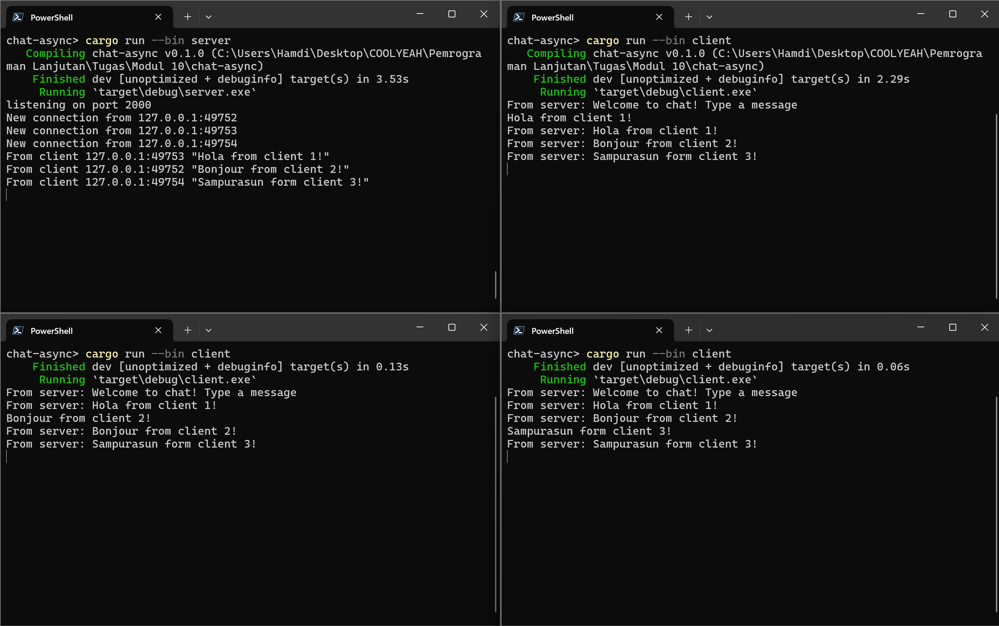
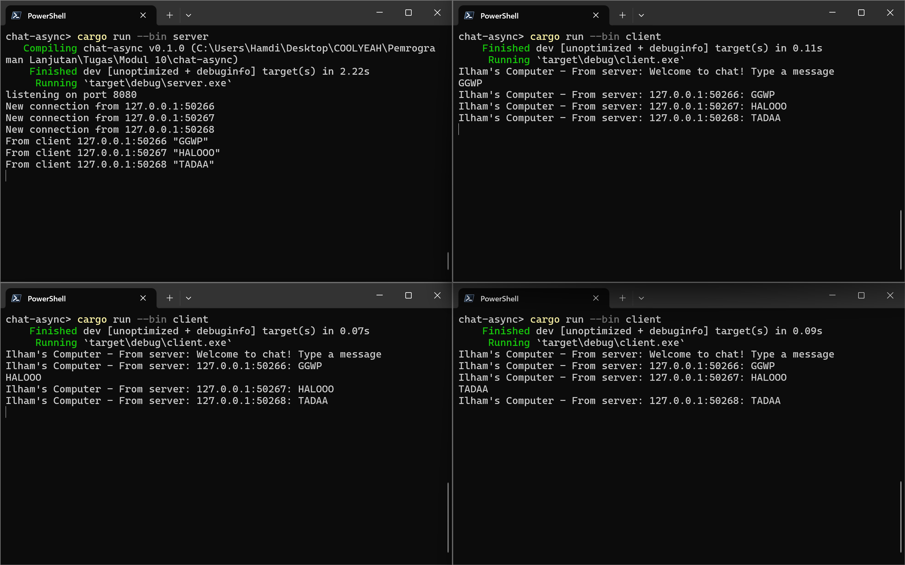

# Advance Programming - Module 10 : Async Programming

Name : Ilham Abdillah Alhamdi <br>
NPM : 2206081194 <br>
Class : Advpro - A <br>

## Reflection Tutorial 1

### 1.2. Understanding how it works

Setelah ditambahkan _statement_ `println!("Ilham's Computer: hey hey");` di luar _async block_, pesan "hey hey" muncul pertama kali, kemudian diikuti oleh pesan "howdy!" serta diakhiri oleh pesan "done!"



Hal ini bisa terjadi karena _async block_ dimana pesan "howdy!" dan "done!" akan dieksekusi pada saat `executor.run()` dijalankan. Pesan "hey hey" sendiri dijalankan sebelum `executor.run()` dijalankan. Dengan demikian pesan "hey hey" seolah-olah mendahului kedua pesan lainnya, meski dituliskan di baris terakhir.

Adapun terkait bagaimana _async block_ tersebut bekerja, berikut merupakan penjelasannya.

-   Async block di-passing sebagai argument di `spawner.spawn`
-   Ketika method `spawn` dipanggil, objek spawner mengirimkan objek Task yang berisikan future berupa _async block_ sebelumnya ke executor melalui _channel queue_.
-   Objek Task tersebut kemudian disimpan dalam _channel queue_ dan siap untuk diterima oleh executor sebagai _receiver_-nya.
-   Executor dijalankan. Pada saat dijalankan, tersedia satu task pada _channel queue_, yaitu task yang dikirimkan oleh spawner sebelumnya. Executor berjalan terus sampai task dalam queue tersebut habis dan tidak ada _transmitter_ lainnya.
-   Saat executor dijalankan, pesan "howdy!" langsung muncul karena langsung dijalankan tanpa menunggu.
-   Saat executor sampai pada keyword `await`, task tersebut menunggu state dari `TimerFuture` jika statusnya masih `Poll:Pending`.
-   Pada fungsi `TimerFuture::new`, ketika waktu durasinya sudah selesai, variabel `completed` di-set true kemudian memanggil `waker.wake`. Fungsi tersebut akan mengirimkan kembali task yang siap dilanjutkan tersebut ke _channel queue_. Executor kemudian akan melanjutkan kode yang tadi sempat tertunda dan melakukan `poll` kembali, namun kali ini dengan status `Poll:Ready`. Timer selama 2 detik pun selesai dan pesan "done!" ditampilkan.

### 1.3 Multiple Spawn and Removing Drop

1.  Multiple Spawn <br>
    Pemanggilan fungsi `spawn` berguna untuk menambahkan _async task_ baru untuk dijalankan. Setiap kali method `spawn` dipanggil, _async block_ tersebut dikirimkan kepada _executor_ sebagai sebuah task.

    Ketika beberapa fungsi `spawn` dijalankan beberapa kali, task-task tersebut akan disimpan dalam _queue_ dan siap dijalankan oleh _executor_. Sesuai dengan konsep _queue_, task yang pertama kali disimpan akan dijalankan pertama kali (First In First Out). Meskipun demikian, untuk mengerjakan task lainnya, task sebelumnya tidak harus selesai terlebih dahulu.

    Saat _executor_ mengambil / melakukan pop suatu task, task tersebut akan terus dijalankan hingga mengembalikan suatu status berupa `Poll::Pending` atau `Poll::Ready<T>`. Jika task tersebut mengembalikan status `Pending`, state dari task tersebut akan disimpan untuk dilanjutkan lagi hingga task tersebut siap. Ketika task tersebut mengembalikan status `Pending` atau `Ready`, _executor_ akan mem-pop task lainnya dari _queue_. Apabila task yang tertunda tadi selesai, task tersebut akan ditambahkan kembali ke dalam _queue_ dan siap dilanjutkan.

    

    Pada kasus ini, task 1 dijalankan terlebih dahulu dan mencetak "howdy!". Kemudian, saat menjalankan _keyword_ `await` di task 1, task tersebut mengembalikan status `Pending`. Kemudian, eksekutor mem-pop task 2 dan mencetak "howdy2!" dan seterusnya hingga task 3. Saat task 1 siap dilanjutkan, task tersebut dimasukkan kembali ke dalam _queue_ dan _exector_ melakukan pop kembali. Task 1 tersebut dilanjutkan dari state terakhir dimana ia dihentikan dan kemudian mencetak "done!". Begitu pula dengan task 2 dan task 3.

2.  Removing Drop <br>
    _Spawner_ dan _executor_ memiliki perannya masing-masing. _Spawner_ berfungsi untuk membuat dan mengirimkan _async task_ ke _executor_. Sedangkan _executor_ berfungsi untuk menjalankan task yang dikirimkan _spawner_. Keduanya berkomunikasi melalui sebuah channel. _Spawnwer_ berperan sebagai _sender_/_transmitter_, sedangkan _executor_ sebagai _receiver_.

    Cara kerja _executor_ dapat kita lihat pada method `Executor::run`, yaitu dengan menjalankan _while loop_ selama masih ada task dalam _channel queue_ tersebut.

    ```rust
    fn run(&self) {
        while let Ok(task) = self.ready_queue.recv() {
          ...
    ```

    Berdasarkan dokumentasi, method `recv` memiliki karakteristik _blocking_ hingga menerima data dari transmitter. Proses _blocking_ akan terhenti apabila _sender_ dari channel tersebut _disconnect_.

    > ```rs
    >   std::sync::mpsc::Receiver
    >   pub fn recv(&self) -> Result<T, RecvError>
    > ```
    >
    > Attempts to wait for a value on this receiver, returning an error if the corresponding channel has hung up. <br><br>
    > This function will always block the current thread if there is no data available and it's possible for more data to be sent (at least one sender still exists). Once a message is sent to the corresponding Sender (or SyncSender), this receiver will wake up and return that message.
    > <br><br>
    > If the corresponding Sender has disconnected, or it disconnects while this call is blocking, this call will wake up and return Err to indicate that no more messages can ever be received on this channel. However, since channels are buffered, messages sent before the disconnect will still be properly received.

    Pada kasus ini, `drop` berfungsi untuk melakukan _disconnect channel_ _spawner_ secara paksa dari _executor_. Dengan demikian, method `recv` mengembalikan error dan _while loop_ pun terhenti. Dengan demikian, _executor_ pun selesai dijalankan dan program berhenti.

    

    Namun, apabila fungsi `drop` dihapus, method _recv_ akan terus menunggu task baru dari _transmitter_ meskipun hal itu tidak akan terjadi. Dengan demikian, _executor_ akan terus dijalankan dan program pun tidak berhenti.

    

## Reflection Tutorial 2

### 2.1 Original code of broadcast chat.

-   How to run it?

    Jalankan command `cargo run --bin server` untuk menjalankan server dan command `cargo run --bin client` untuk menjalankan client.

-   What happen when we type some text in the clients

    Berikut merupakan _screenshot_ dari terminal yang menjalankan sebuah server dan tiga buah client.

    

    Ketika kita menuliskan sebuah baris teks di sebuah client, teks tersebut akan dikirimkan ke server melalui koneksi Websocket. Setelah menerima teks tersebut, server mencetaknya di terminal server, kemudian mem-_broadcast_ ke seluruh client yang sedang terhubung. Semua _client_ menerima teks tersebut dan kemudian dicetak di terminal masing-masing.

### 2.2 Modifying the websocket port

Untuk mengubah port menjadi 8080, kita perlu mengubahnya di kode client  dan server. Pada server, kita dapat mengubahnya pada baris kode berikut.

```rust
let listener = TcpListener::bind("127.0.0.1:8080").await?;
```

Sedangkan pada client, kita perlu mengubah baris kode berikut.

```rust
let (mut ws_stream, _) =
    ClientBuilder::from_uri(Uri::from_static("ws://127.0.0.1:8080")).connect().await?;
```

Port 8080 di-set menjadi port server. Di sini, kita hanya perlu mendefinisikan port servernya saja. Untuk membuat koneksi, client perlu tahu _address_ dari server, sedangkan server tidak perlu tahu _addrss_ client karena server hanya bertugas untuk menunggu koneksi. Port dari masing-masing client ditentukan oleh library `tokio_websockets` pada saat pemanggilan `ClientBuilder::new().connect()`.


### 2.3 Experiment 2.3: Small changes, add IP and Port

Untuk menambahkan alamat IP dan Port pengirim ke dalam pesan broadcast, kita dapat mengubah fungsi `handle_connection` pada server menjadi berikut.

```rust
async fn handle_connection(
   ...
) -> Result<(), Box<dyn Error + Send + Sync>> {
   ...
    loop {
        tokio::select! {
            incoming = ws_stream.next() => {
                match incoming {
                    Some(Ok(msg)) => {
                        if let Some(text) = msg.as_text() {
                            println!("From client {addr:?} {text:?}");
                            bcast_tx.send(format!("{addr}: {text}"))?;
                        }
                    }
                    ...
                }
            }
        }
    }
}

```
Perubahan dilakukan pada line `bcast_tx.send()` dengan mengubah argumen yang di-passing. Argumen ditambahkan address dari client pengirim pesan. Dengan demikian, setiap pesan broadcast yang dikirim mengandung informasi IP dan Port pengirimnya. Berikut merupakan tangkapan layarnya.


